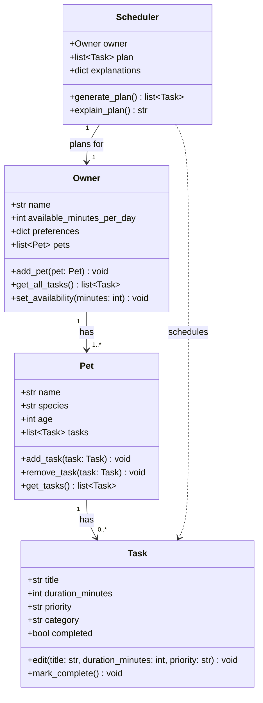

# PawPal+ UML Class Diagram (initial design)

```mermaid
classDiagram
    class Owner {
        +str name
        +int available_minutes_per_day
        +dict preferences
        +list~Pet~ pets
        +add_pet(pet: Pet) void
        +get_all_tasks() list~Task~
        +set_availability(minutes: int) void
    }

    class Pet {
        +str name
        +str species
        +int age
        +list~Task~ tasks
        +add_task(task: Task) void
        +remove_task(task: Task) void
        +get_tasks() list~Task~
    }

    class Task {
        +str title
        +int duration_minutes
        +str priority
        +str category
        +bool completed
        +edit(title: str, duration_minutes: int, priority: str) void
        +mark_complete() void
    }

    class Scheduler {
        +Owner owner
        +list~Task~ plan
        +dict explanations
        +generate_plan() list~Task~
        +explain_plan() str
    }

    Owner "1" --> "1..*" Pet : has
    Pet "1" --> "0..*" Task : has
    Scheduler "1" --> "1" Owner : plans for
    Scheduler ..> Task : schedules
```
